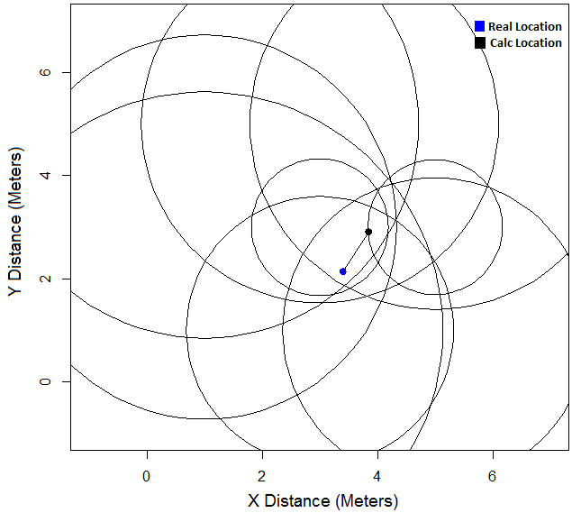
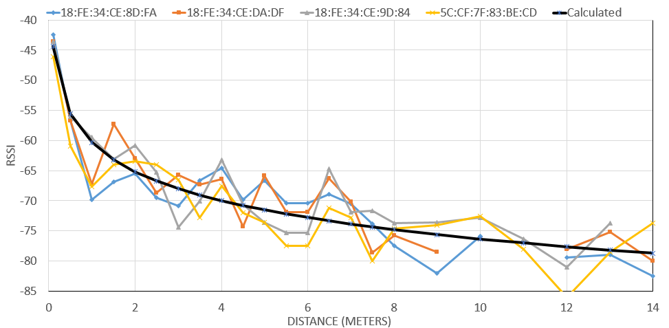
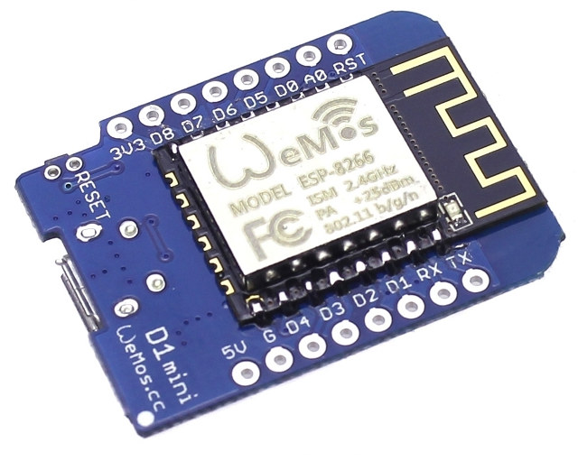
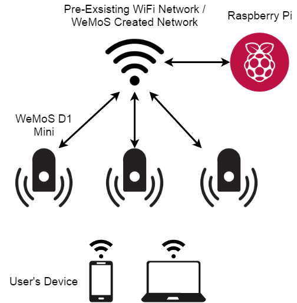
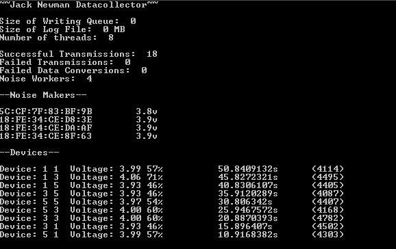

# Passive ESP8266 Localisation
Passive Indoor Localisation of WiFi devices using ESP8266 sensors

The goal of this thesis was to create a system that could passively monitor WiFi communication between devices and use it for localisation on an extremely small budget. After optimisations, the final system had an average accuracy of around 1m to 2m based on the size of the room and the density of sensors. 

Using the Log Path-Loss Model, the captured signal strength of a device could be converted to a rough estimation of distance. Using this information from  multiple sensors, trilateration can be used to calculated the most likely position of the device.

**Sensors per M^2**| Average Accuracy (Metres)
:-----:|:-----:
0.500| 0.850961
0.250| 1.780643
0.222| 1.927404
0.194| 1.973552
0.167| 2.056813
0.139| 2.16142
0.111| 2.28636

# The Setup
## The Sniffers
The ESP8266, an extremely low-cost microcontroller, was used and deployed as a WiFi sniffer, reporting back the signal strengths of nearby devices at a regular interval to a server. The data backbone relies on a pre-existing network.
Data is serialised using Protobufs.

* Fast Flashing Light: The device is currently attempting to connect
or find the WiFi network
* Light Off: Device is currently searching for the server that manages
each of the devices
* Light Solid: Connected to the server and waiting for a command (the server will automatically send the approriate commands)

## The Generators
The WeMoSNoiseGenerator folder contains code for esp8266 firmware that simply connects to a WiFi network and generates random traffic.  This allows for easier plotting for the thesis and small sampling times.

## Base Station
The basestation hardware was a Raspberry Pi. The data backbone was a pre-existing network. (This needs to exist already so that unexpecting devices will generate enough data to be tracked)

The server is fairly basic and sets up a few go-routines to log data from the WeMoS devices when they phone home.

An an image of it working:

